# Certification Lifecycle and Results Data Model

> **Type:** design study — *not* an ADR. It describes the state machine that the
> code implements today, names the edge cases it currently has, and sketches the
> shape of an archival data model. Any decision it motivates should get its own
> numbered ADR.
>
> **Scope:** `Certification → Workflow → Job → workload`, the two measurement
> tiers, and how all of it turns into a verdict about physical nodes.

---

## 1. The three vocabularies

The system continuously translates between three vocabularies. Almost every edge
case in this document is a lossy step in one of these translations.

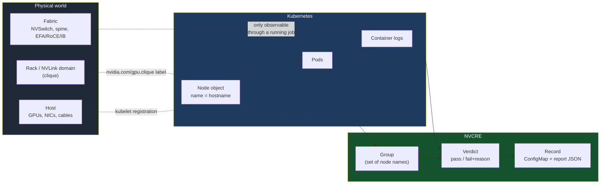
```mermaid
flowchart LR
    subgraph PHYS["Physical world"]
        direction TB
        RACK["Rack / NVLink domain<br/>(clique)"]
        HOST["Host<br/>GPUs, NICs, cables"]
        FAB["Fabric<br/>NVSwitch, spine, EFA/RoCE/IB"]
    end
    subgraph K8S["Kubernetes"]
        direction TB
        NODE["Node object<br/>name = hostname"]
        POD["Pods"]
        LOGS["Container logs"]
    end
    subgraph NVCRE["NVCRE"]
        direction TB
        GRP["Group<br/>(set of node names)"]
        VERD["Verdict<br/>pass / fail+reason"]
        REC["Record<br/>ConfigMap + report JSON"]
    end

    RACK -.->|"nvidia.com/gpu.clique label"| NODE
    HOST -.->|"kubelet registration"| NODE
    FAB -.->|"only observable<br/>through a running job"| LOGS
    NODE --> POD --> LOGS
    NODE --> GRP
    LOGS --> VERD
    GRP --> VERD
    VERD --> REC

    style PHYS fill:#1f2937,color:#f9fafb
    style K8S fill:#1e3a5f,color:#f9fafb
    style NVCRE fill:#14532d,color:#f9fafb
```

**The central asymmetry:** NVCRE *tests* a **group** but *reports* a **node**.
A fabric fault has no node to blame, so the group's verdict is stamped onto every
member. `diagnose` mode exists to narrow that blast radius.

---

## 2. Object graph: what exists while a run is in flight

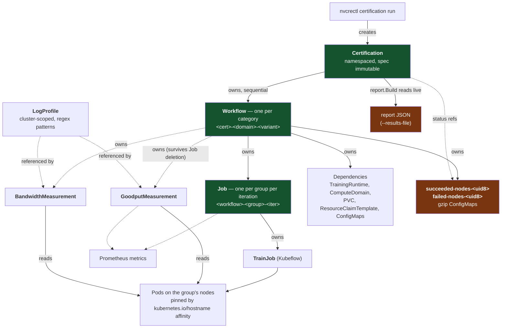
```mermaid
flowchart TD
    CLI["nvcrectl certification run"]
    CERT["<b>Certification</b><br/>namespaced, spec immutable"]
    WF["<b>Workflow</b> — one per category<br/>&lt;cert&gt;-&lt;domain&gt;-&lt;variant&gt;"]
    JOB["<b>Job</b> — one per group per iteration<br/>&lt;workflow&gt;-&lt;group&gt;-&lt;iter&gt;"]
    TJ["<b>TrainJob</b> (Kubeflow)"]
    PODS["Pods on the group's nodes<br/>pinned by kubernetes.io/hostname affinity"]
    GM["<b>GoodputMeasurement</b>"]
    BM["<b>BandwidthMeasurement</b>"]
    LP["<b>LogProfile</b><br/>cluster-scoped, regex patterns"]
    DEPS["Dependencies<br/>TrainingRuntime, ComputeDomain,<br/>PVC, ResourceClaimTemplate, ConfigMaps"]
    CMS["<b>succeeded-nodes-&lt;uid8&gt;</b><br/><b>failed-nodes-&lt;uid8&gt;</b><br/>gzip ConfigMaps"]
    PROM["Prometheus metrics"]
    JSON["report JSON<br/>(--results-file)"]

    CLI -->|creates| CERT
    CERT -->|owns, sequential| WF
    WF -->|owns| JOB
    WF -->|owns| DEPS
    WF -->|owns| CMS
    WF -.->|"owns (survives Job deletion)"| GM
    WF -.->|owns| BM
    JOB -->|owns| TJ
    TJ --> PODS
    GM -->|reads| PODS
    BM -->|reads| PODS
    LP -.->|referenced by| GM
    LP -.->|referenced by| BM
    CERT -.->|"status refs"| CMS
    CERT -->|"report.Build reads live"| JSON
    JOB -.-> PROM
    GM -.-> PROM

    style CERT fill:#14532d,color:#f9fafb
    style WF fill:#14532d,color:#f9fafb
    style JOB fill:#14532d,color:#f9fafb
    style CMS fill:#78350f,color:#f9fafb
    style JSON fill:#78350f,color:#f9fafb
```

Ownership rules that matter for archiving:

| Object | Owner | Survives | Notes |
|---|---|---|---|
| Workflow | Certification | cert deletion → gone | one per category |
| Job | Workflow | iteration rollover → **deleted** | retried Jobs are deleted too |
| GoodputMeasurement / BandwidthMeasurement | **Workflow**, not Job | Job deletion | deliberate, so the report can read them after Jobs are gone |
| succeeded/failed-nodes ConfigMap | Workflow | Job deletion | the only durable per-node record in-cluster |
| TrainJob + pods | Job | preserved on terminal state for log inspection | deleted on failure to free GPUs |
| report JSON | nothing — a file | forever | **the only true archive today** |

---

## 3. Where the workload is defined

No Go code knows what `nemotron5-8b` or `nccl-all-reduce` means. Every certification
category is one declarative YAML file, embedded into the binary at compile time and
rendered as a Go template. Adding a category means adding a file and nothing else.

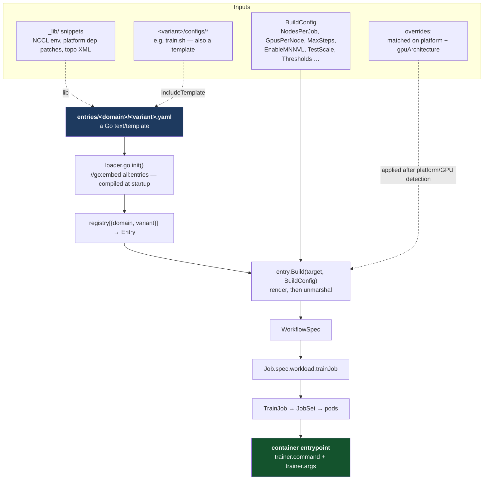
```mermaid
flowchart TD
    subgraph IN["Inputs"]
      LIB["_lib/ snippets<br/>NCCL env, platform dep patches, topo XML"]
      CFG["&lt;variant&gt;/configs/*<br/>e.g. train.sh — also a template"]
      BC["BuildConfig<br/>NodesPerJob, GpusPerNode, MaxSteps,<br/>EnableMNNVL, TestScale, Thresholds …"]
      OVR["overrides:<br/>matched on platform + gpuArchitecture"]
    end
    Y["<b>entries/&lt;domain&gt;/&lt;variant&gt;.yaml</b><br/>a Go text/template"]
    L["loader.go init()<br/>//go:embed all:entries — compiled at startup"]
    R["registry[{domain, variant}] → Entry"]
    B["entry.Build(target, BuildConfig)<br/>render, then unmarshal"]
    WS["WorkflowSpec"]
    JT["Job.spec.workload.trainJob"]
    TJ["TrainJob → JobSet → pods"]
    EP["<b>container entrypoint</b><br/>trainer.command + trainer.args"]

    LIB -.->|lib| Y
    CFG -.->|includeTemplate| Y
    Y --> L --> R --> B
    BC --> B
    OVR -.->|"applied after platform/GPU detection"| B
    B --> WS --> JT --> TJ --> EP

    style Y fill:#1e3a5f,color:#f9fafb
    style EP fill:#14532d,color:#f9fafb
```

### 3.1 Three shapes of entrypoint

The literal entrypoint is the `trainer.command` / `trainer.args` pair in each entry's
`jobTemplate`. The categories reach it three different ways.

| Category | Shape | What actually runs |
|---|---|---|
| `communication/nccl-all-reduce` | inline in the entry YAML | `timeout 3600 mpirun … all_reduce_perf_mpi -b 8 -e 16G -f 2 -n 100 -N 10`, in the `launcher` replicated job. The `node` job runs only `sshd` so mpirun can reach the workers. |
| `training/nemotron5-8b` | a script in a sibling directory | The entry says only `/bin/bash /config/train.sh`. `configs/train.sh` is pulled in with `includeTemplate`, shipped as a ConfigMap dependency, and ends at `exec torchrun … pretrain_gpt.py` with about 60 Megatron-LM flags. Megatron-LM is git-cloned by an initContainer at pod start. |
| `diagnostics/dcgm-level4` | a binary, no script | `dcgmi diag --host nvidia-dcgm.gpu-operator.svc:5555 --run 4 --json`, single node. |

### 3.2 Directory conventions

The loader decides what is a category purely by path shape — exactly one directory
level deep, and not under `_lib/`.

```text
entries/
  <domain>/<variant>.yaml     registered as a category
  <domain>/<variant>/         not registered — data for that entry
      meta.yaml               minGPUs, TP/PP per arch, timeoutPerJob
      configs/train.sh        pulled in with includeTemplate
  _lib/                       not registered — shared snippets
      nccl/*.yaml             env blocks, mpirun args, perf flags
      deps/*.yaml             per-platform TrainingRuntime patches
      topo/*.xml              NCCL topology files
```

Template helpers available inside an entry: `lib` (from `_lib/`, hard-fails when
missing), `includeTemplate` and `includeFile` (from the entry's own directory,
silently empty when missing), `toMpiArgs` (turns a `name`/`value` env list into
`-x VAR=VAL` pairs), plus `indent`, `mul`, `int` and `toYaml`.

### 3.3 Override semantics

A `jobTemplate` override is a strategic merge patch and **replaces arrays wholesale** —
setting `trainer.env` wipes the base env rather than merging by name.
`jobTemplatePatch` is RFC 6902 and can append with `op: add, path: /…/env/-`.
Overrides apply in listed order, so a patch must come after any `jobTemplate`
override that sets the same array.

Overrides also swap the entrypoint itself. On AWS EFA the NCCL entry moves to
`/opt/amazon/openmpi/bin/mpirun` and `/opt/nccl-tests/build/all_reduce_perf`, because
that image carries the `aws-ofi-nccl` plugin. The nemotron entry does the reverse on
AWS — it removes `/opt/amazon` and unsets the NCCL plugin variables before exec'ing
the same script.

### 3.4 Why this belongs in a results document

The rendered entry — template, plus resolved `BuildConfig`, plus the image the
overrides landed on — is the complete definition of what was tested. It is also the
provenance that rule R6 (§9.3) asks for, and none of it is recorded today. The
Certification spec is immutable, but the catalog revision, the resolved command line
and the image digests are not stored anywhere. Two runs of `nemotron5-8b` a month
apart can execute different Megatron-LM code (the clone is branch-pinned, not
commit-pinned) and produce results that nothing downstream can tell apart.

---

## 4. State machines

### 4.1 Certification

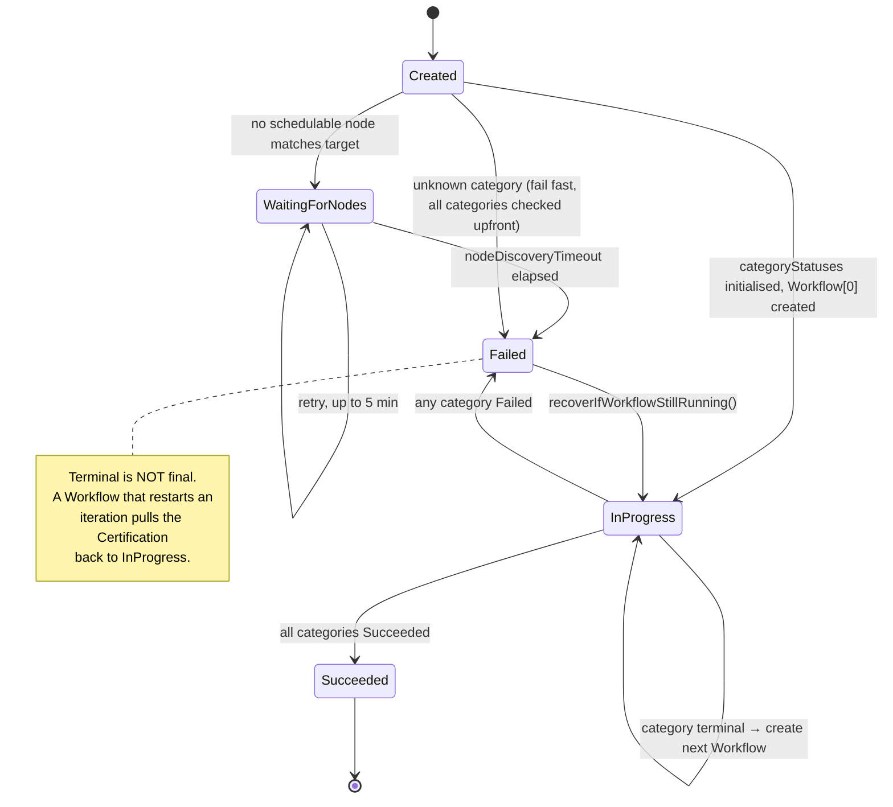
```mermaid
stateDiagram-v2
    [*] --> Created
    Created --> WaitingForNodes: no schedulable node matches target
    WaitingForNodes --> WaitingForNodes: retry, up to 5 min
    WaitingForNodes --> Failed: nodeDiscoveryTimeout elapsed
    Created --> Failed: unknown category (fail fast, all categories checked upfront)
    Created --> InProgress: categoryStatuses initialised, Workflow[0] created

    InProgress --> InProgress: category terminal → create next Workflow
    InProgress --> Succeeded: all categories Succeeded
    InProgress --> Failed: any category Failed

    Succeeded --> [*]
    Failed --> InProgress: recoverIfWorkflowStillRunning()
    note right of Failed
        Terminal is NOT final.
        A Workflow that restarts an
        iteration pulls the Certification
        back to InProgress.
    end note
```

**Categories run strictly sequentially.** `processNextCategory` finds the *first*
non-terminal category; a failed category does not stop the run — the next category
still executes. The Certification's verdict is the AND over categories.

### 4.2 Workflow

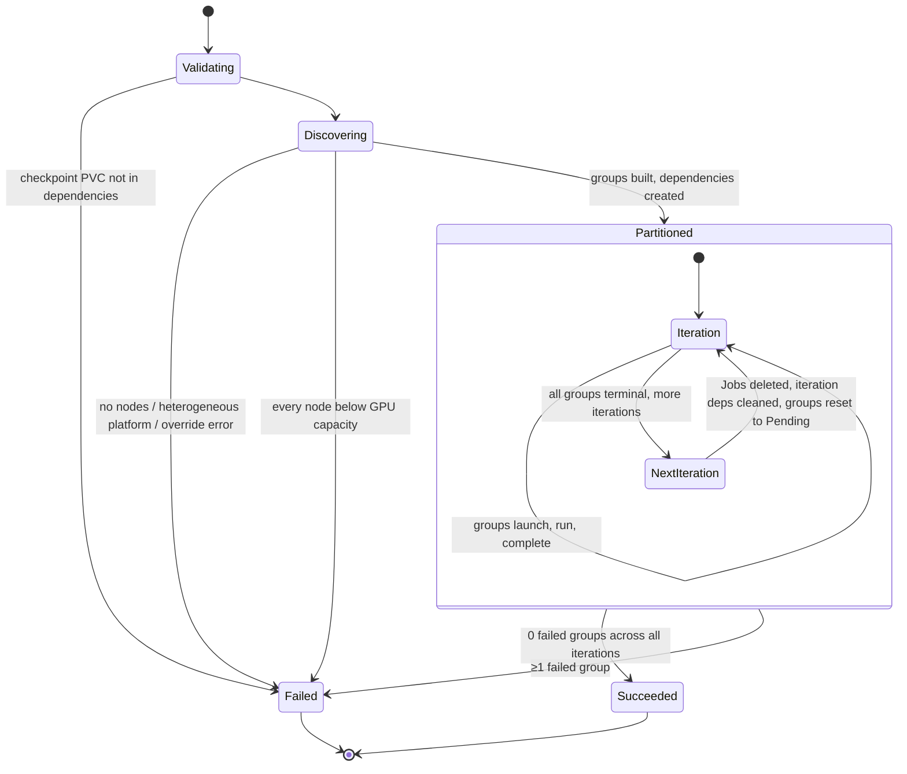
```mermaid
stateDiagram-v2
    [*] --> Validating
    Validating --> Failed: checkpoint PVC not in dependencies
    Validating --> Discovering

    Discovering --> Failed: no nodes / heterogeneous platform / override error
    Discovering --> Failed: every node below GPU capacity
    Discovering --> Partitioned: groups built, dependencies created

    state Partitioned {
        [*] --> Iteration
        Iteration --> Iteration: groups launch, run, complete
        Iteration --> NextIteration: all groups terminal, more iterations
        NextIteration --> Iteration: Jobs deleted, iteration deps cleaned, groups reset to Pending
    }

    Partitioned --> Succeeded: 0 failed groups across all iterations
    Partitioned --> Failed: ≥1 failed group
    Succeeded --> [*]
    Failed --> [*]
```

Exclusions are recorded during `Discovering` and **do not** fail the Workflow:

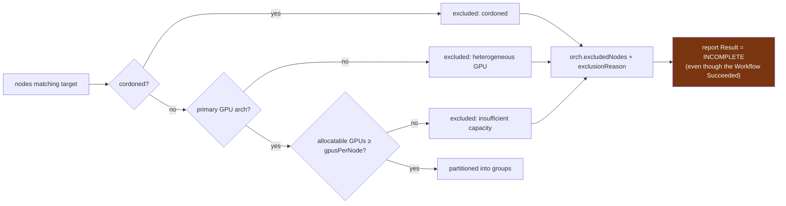
```mermaid
flowchart LR
    T["nodes matching target"] --> C{cordoned?}
    C -->|yes| EX1["excluded: cordoned"]
    C -->|no| A{"primary GPU arch?"}
    A -->|no| EX2["excluded: heterogeneous GPU"]
    A -->|yes| G{"allocatable GPUs ≥ gpusPerNode?"}
    G -->|no| EX3["excluded: insufficient capacity"]
    G -->|yes| P["partitioned into groups"]
    EX1 & EX2 & EX3 --> SUM["orch.excludedNodes + exclusionReason"]
    SUM --> INC["report Result = INCOMPLETE<br/>(even though the Workflow Succeeded)"]

    style INC fill:#78350f,color:#f9fafb
```

### 4.3 Group — the real unit of work

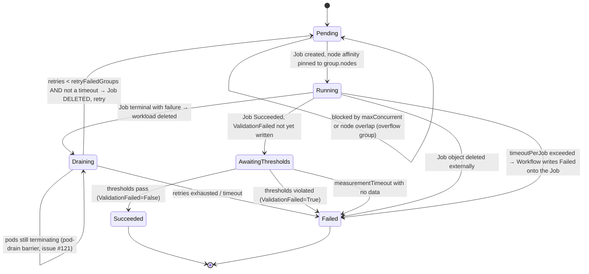
```mermaid
stateDiagram-v2
    [*] --> Pending
    Pending --> Pending: blocked by maxConcurrent or node overlap (overflow group)
    Pending --> Running: Job created, node affinity pinned to group.nodes

    Running --> Draining: Job terminal with failure → workload deleted
    Draining --> Draining: pods still terminating (pod-drain barrier, issue #121)
    Draining --> Pending: retries < retryFailedGroups AND not a timeout → Job DELETED, retry
    Draining --> Failed: retries exhausted / timeout

    Running --> AwaitingThresholds: Job Succeeded, ValidationFailed not yet written
    AwaitingThresholds --> Succeeded: thresholds pass (ValidationFailed=False)
    AwaitingThresholds --> Failed: thresholds violated (ValidationFailed=True)
    AwaitingThresholds --> Failed: measurementTimeout with no data

    Running --> Failed: Job object deleted externally
    Running --> Failed: timeoutPerJob exceeded → Workflow writes Failed onto the Job
    Succeeded --> [*]
    Failed --> [*]
```

> **Note the cross-tier write:** on `timeoutPerJob` the *Workflow* controller sets
> the `Failed` condition on the *Job* object, after capturing a log tail. The Job
> controller is not the sole author of Job status.

### 4.4 Job — two orthogonal condition axes

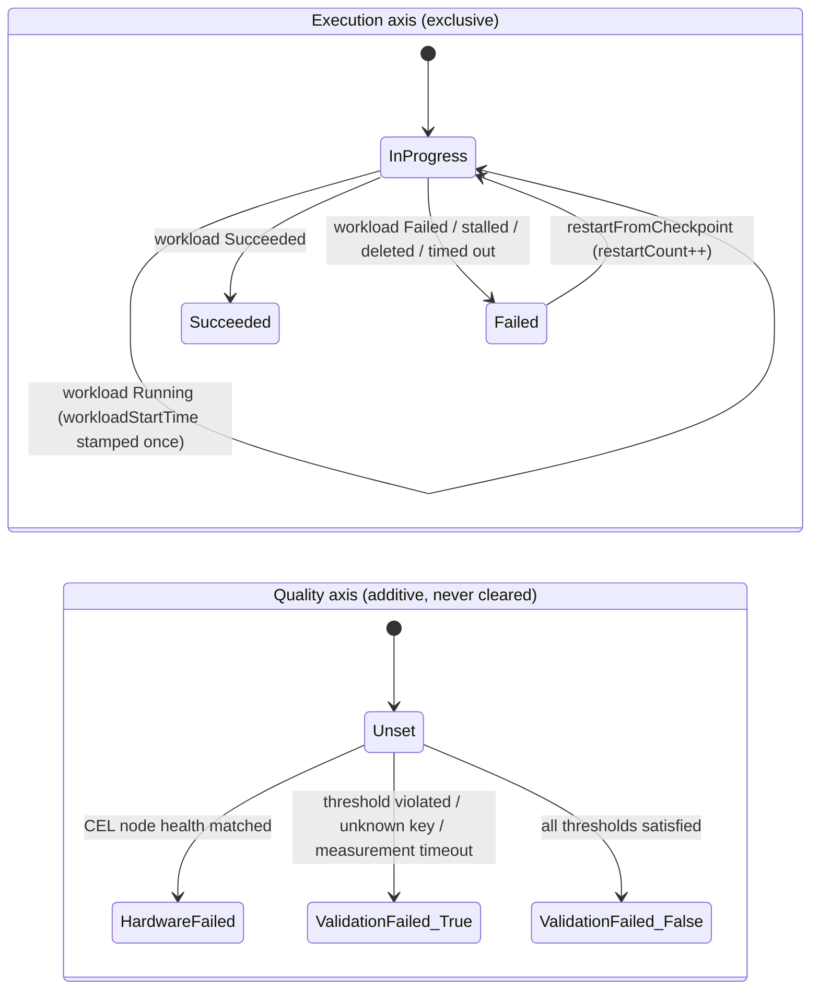
```mermaid
stateDiagram-v2
    direction LR
    state "Execution axis (exclusive)" as EXEC {
        [*] --> InProgress
        InProgress --> InProgress: workload Pending (Kueue-suspended — clock not started)
        InProgress --> InProgress: workload Running (workloadStartTime stamped once)
        InProgress --> Succeeded: workload Succeeded
        InProgress --> Failed: workload Failed / stalled / deleted / timed out
        Failed --> InProgress: restartFromCheckpoint (restartCount++)
    }
    state "Quality axis (additive, never cleared)" as QUAL {
        [*] --> Unset
        Unset --> HardwareFailed: CEL node health matched
        Unset --> ValidationFailed_True: threshold violated / unknown key / measurement timeout
        Unset --> ValidationFailed_False: all thresholds satisfied
    }
```

`terminal = Succeeded ∨ Failed ∨ HardwareFailed`. Therefore:

| Job condition set | Group outcome | Why it surprises people |
|---|---|---|
| `Succeeded=True`, `ValidationFailed=False` | **Succeeded** | happy path |
| `Succeeded=True`, `ValidationFailed=True` | **Failed** | the workload exited 0; the *numbers* failed |
| `InProgress=True`, `HardwareFailed=True` | **Failed** | terminal without ever setting `Failed` |
| `Failed=True` (timeout, by the Workflow) | **Failed**, never retried | `isJobTimedOutFailure` excludes it from retry |

### 4.5 Measurements

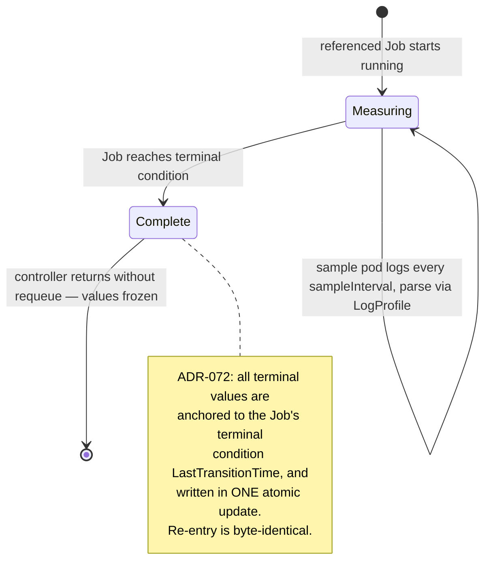
```mermaid
stateDiagram-v2
    [*] --> Measuring: referenced Job starts running
    Measuring --> Measuring: sample pod logs every sampleInterval, parse via LogProfile
    Measuring --> Complete: Job reaches terminal condition
    Complete --> [*]: controller returns without requeue — values frozen

    note right of Complete
        ADR-072: all terminal values are
        anchored to the Job's terminal
        condition LastTransitionTime, and
        written in ONE atomic update.
        Re-entry is byte-identical.
    end note
```

`collectJobMeasuredValues` refuses goodput-derived keys while `Complete != True`,
so a threshold verdict is never computed from a provisional value.

### 4.6 The implicit per-node state machine

This one is not in any CRD — it is the *emergent* lifecycle, and it is the state
machine an archive actually needs to capture.

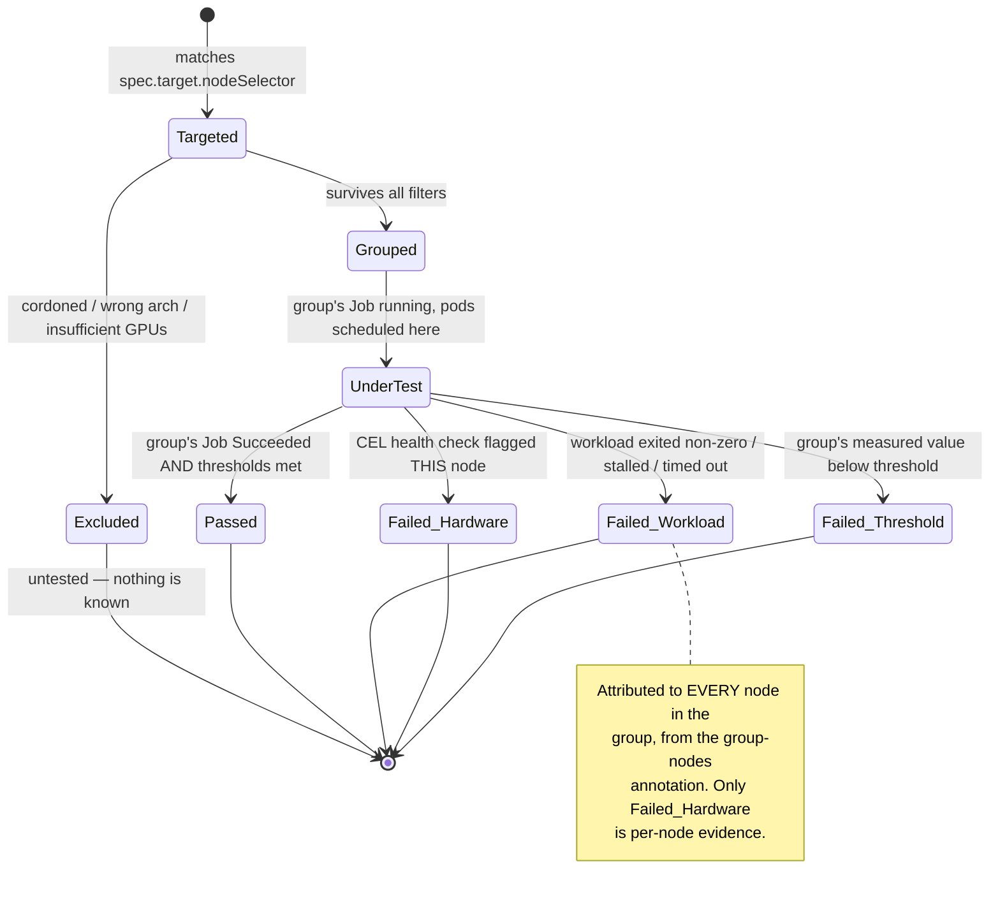
```mermaid
stateDiagram-v2
    [*] --> Targeted: matches spec.target.nodeSelector
    Targeted --> Excluded: cordoned / wrong arch / insufficient GPUs
    Targeted --> Grouped: survives all filters
    Grouped --> UnderTest: group's Job running, pods scheduled here
    UnderTest --> Passed: group's Job Succeeded AND thresholds met
    UnderTest --> Failed_Workload: workload exited non-zero / stalled / timed out
    UnderTest --> Failed_Hardware: CEL health check flagged THIS node
    UnderTest --> Failed_Threshold: group's measured value below threshold
    Excluded --> [*]: untested — nothing is known
    Passed --> [*]
    Failed_Workload --> [*]
    Failed_Hardware --> [*]
    Failed_Threshold --> [*]

    note right of Failed_Workload
        Attributed to EVERY node in the
        group, from the group-nodes
        annotation. Only Failed_Hardware
        is per-node evidence.
    end note
```

**Attribution fidelity, by reason:**

| Reason | Evidence granularity | Set by |
|---|---|---|
| `HardwareFailureDetected` | **per node** — CEL evaluated against that Node object | `setJobHardwareFailed` |
| `ThresholdViolation` | **per group** — one measured value blamed on all members | `setJobValidationStatus` |
| `WorkloadFailed` | **per group** — all members of `group-nodes` annotation | `setJobFailed` |

---

## 5. Verdict roll-up

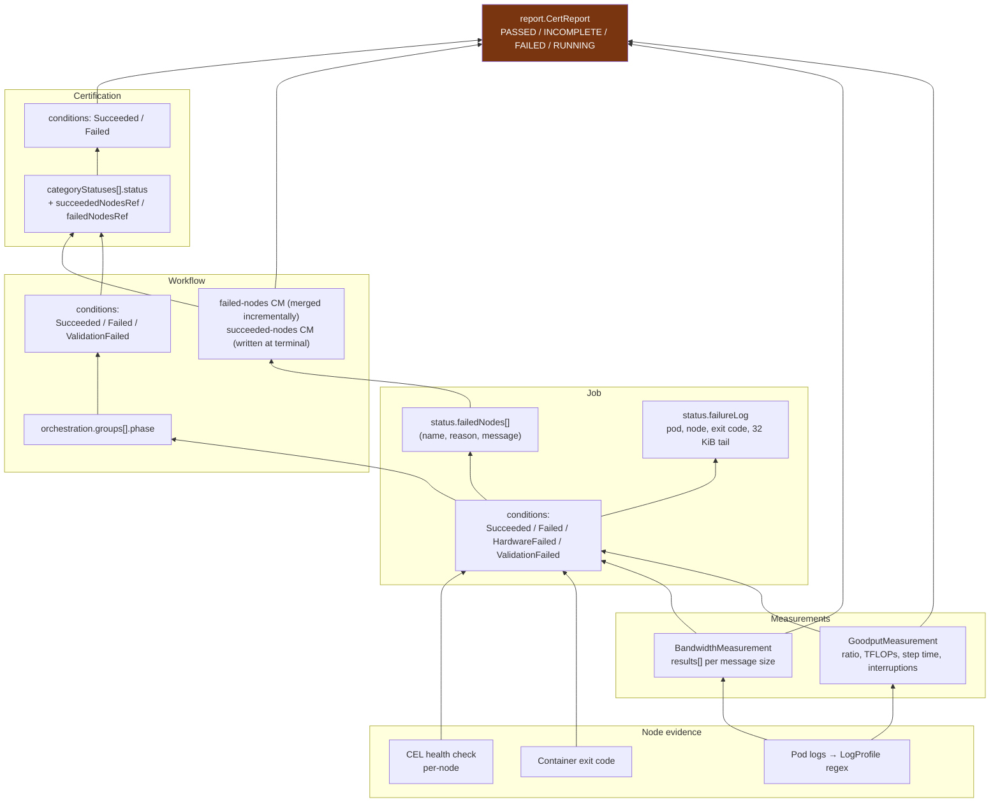
```mermaid
flowchart BT
    subgraph N["Node evidence"]
        CEL["CEL health check<br/>per-node"]
        LOGSRC["Pod logs → LogProfile regex"]
        EXIT["Container exit code"]
    end
    subgraph J["Job"]
        JC["conditions:<br/>Succeeded / Failed / HardwareFailed / ValidationFailed"]
        JFN["status.failedNodes[]<br/>(name, reason, message)"]
        JFL["status.failureLog<br/>pod, node, exit code, 32 KiB tail"]
    end
    subgraph M["Measurements"]
        BW["BandwidthMeasurement<br/>results[] per message size"]
        GP["GoodputMeasurement<br/>ratio, TFLOPs, step time, interruptions"]
    end
    subgraph W["Workflow"]
        GS["orchestration.groups[].phase"]
        WC["conditions:<br/>Succeeded / Failed / ValidationFailed"]
        WCM["failed-nodes CM (merged incrementally)<br/>succeeded-nodes CM (written at terminal)"]
    end
    subgraph C["Certification"]
        CCS["categoryStatuses[].status<br/>+ succeededNodesRef / failedNodesRef"]
        CC["conditions: Succeeded / Failed"]
    end
    R["report.CertReport<br/>PASSED / INCOMPLETE / FAILED / RUNNING"]

    CEL --> JC
    EXIT --> JC
    LOGSRC --> BW
    LOGSRC --> GP
    BW --> JC
    GP --> JC
    JC --> JFN
    JC --> JFL
    JFN --> WCM
    JC --> GS
    GS --> WC
    WCM --> CCS
    WC --> CCS
    CCS --> CC
    CC --> R
    WCM --> R
    BW --> R
    GP --> R

    style R fill:#78350f,color:#f9fafb
```

**Verdict truth table at the top:**

| Cert condition | excludedNodes | report `Result` | CLI exit (`run --wait`, `report`) |
|---|---|---|---|
| `Succeeded=True` | empty | `PASSED` | 0 |
| `Succeeded=True` | non-empty | `INCOMPLETE` | 0 — *a warning that fails the build is not a warning* |
| `Failed=True` | any | `FAILED` | non-zero |
| neither | any | `RUNNING` | non-zero |

`INCOMPLETE` is the one verdict that cannot be derived from the Certification's
conditions alone — it needs `orchestration.excludedNodes` from the Workflow. Any
archive that stores only the top-level condition loses it.

---

## 6. Happy path

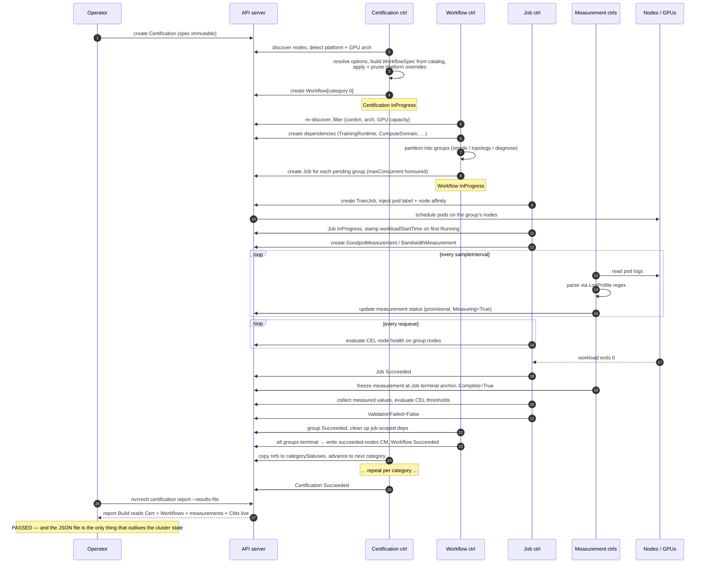
```mermaid
sequenceDiagram
    autonumber
    participant U as Operator
    participant K as API server
    participant CC as Certification ctrl
    participant WC as Workflow ctrl
    participant JC as Job ctrl
    participant MC as Measurement ctrls
    participant HW as Nodes / GPUs

    U->>K: create Certification (spec immutable)
    CC->>K: discover nodes, detect platform + GPU arch
    CC->>CC: resolve options, build WorkflowSpec from catalog,<br/>apply + prune platform overrides
    CC->>K: create Workflow[category 0]
    Note over CC: Certification InProgress

    WC->>K: re-discover, filter (cordon, arch, GPU capacity)
    WC->>K: create dependencies (TrainingRuntime, ComputeDomain, …)
    WC->>WC: partition into groups (simple / topology / diagnose)
    WC->>K: create Job for each pending group (maxConcurrent honoured)
    Note over WC: Workflow InProgress

    JC->>K: create TrainJob, inject pod label + node affinity
    K->>HW: schedule pods on the group's nodes
    JC->>K: Job InProgress, stamp workloadStartTime on first Running
    JC->>K: create GoodputMeasurement / BandwidthMeasurement

    loop every sampleInterval
        MC->>HW: read pod logs
        MC->>MC: parse via LogProfile regex
        MC->>K: update measurement status (provisional, Measuring=True)
    end

    loop every requeue
        JC->>K: evaluate CEL node health on group nodes
    end

    HW-->>JC: workload exits 0
    JC->>K: Job Succeeded
    MC->>K: freeze measurement at Job terminal anchor, Complete=True
    JC->>K: collect measured values, evaluate CEL thresholds
    JC->>K: ValidationFailed=False

    WC->>K: group Succeeded, clean up job-scoped deps
    WC->>K: all groups terminal → write succeeded-nodes CM, Workflow Succeeded
    CC->>K: copy refs to categoryStatuses, advance to next category
    Note over CC: … repeat per category …
    CC->>K: Certification Succeeded

    U->>K: nvcrectl certification report --results-file
    K-->>U: report.Build reads Cert + Workflows + measurements + CMs live
    Note over U: PASSED — and the JSON file is the only thing that outlives the cluster state
```

---

## 7. Data flow

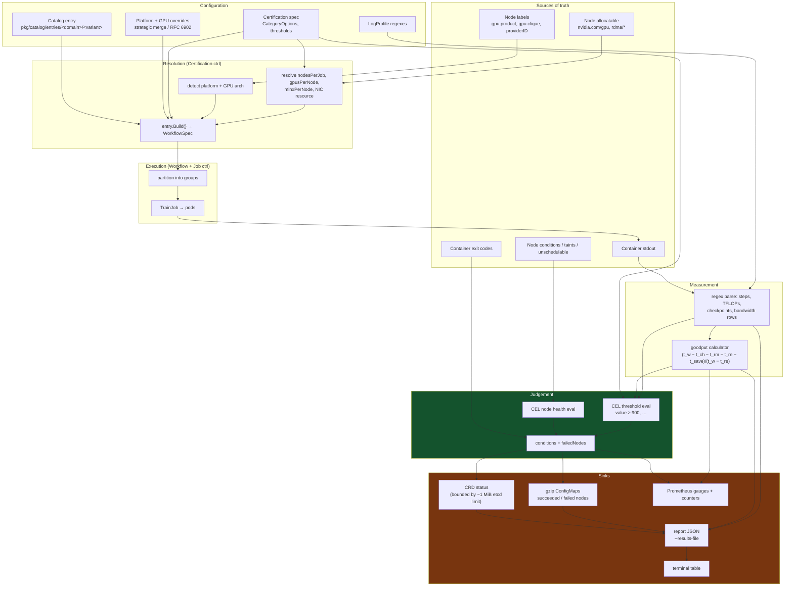
```mermaid
flowchart TD
    subgraph SRC["Sources of truth"]
        NL["Node labels<br/>gpu.product, gpu.clique, providerID"]
        NA["Node allocatable<br/>nvidia.com/gpu, rdma/*"]
        NC["Node conditions / taints / unschedulable"]
        STDOUT["Container stdout"]
        EXITC["Container exit codes"]
    end

    subgraph CFG["Configuration"]
        CAT["Catalog entry<br/>pkg/catalog/entries/&lt;domain&gt;/&lt;variant&gt;"]
        OVR["Platform + GPU overrides<br/>strategic merge / RFC 6902"]
        SPEC["Certification spec<br/>CategoryOptions, thresholds"]
        LPROF["LogProfile regexes"]
    end

    subgraph RESOLVE["Resolution (Certification ctrl)"]
        DET["detect platform + GPU arch"]
        NPJ["resolve nodesPerJob, gpusPerNode,<br/>mlnxPerNode, NIC resource"]
        BUILD["entry.Build() → WorkflowSpec"]
    end

    subgraph EXEC["Execution (Workflow + Job ctrl)"]
        PART["partition into groups"]
        RUN["TrainJob → pods"]
    end

    subgraph MEASURE["Measurement"]
        PARSE["regex parse: steps, TFLOPs,<br/>checkpoints, bandwidth rows"]
        CALC["goodput calculator<br/>(t_w − t_ch − t_rm − t_re − t_save)/(t_w − t_re)"]
    end

    subgraph JUDGE["Judgement"]
        CELT["CEL threshold eval<br/>value ≥ 900, …"]
        CELH["CEL node health eval"]
        COND["conditions + failedNodes"]
    end

    subgraph SINK["Sinks"]
        CM["gzip ConfigMaps<br/>succeeded / failed nodes"]
        CRD["CRD status<br/>(bounded by ~1 MiB etcd limit)"]
        PROM2["Prometheus gauges + counters"]
        JSONOUT["report JSON<br/>--results-file"]
        TERM["terminal table"]
    end

    NL --> DET
    NA --> NPJ
    NC --> CELH
    CAT --> BUILD
    OVR --> BUILD
    SPEC --> NPJ
    SPEC --> BUILD
    SPEC --> CELT
    DET --> BUILD
    NPJ --> BUILD
    BUILD --> PART --> RUN
    RUN --> STDOUT --> PARSE
    LPROF --> PARSE
    PARSE --> CALC
    CALC --> CELT
    PARSE --> CELT
    EXITC --> COND
    CELH --> COND
    CELT --> COND
    COND --> CM
    COND --> CRD
    COND --> PROM2
    CALC --> PROM2
    CRD --> JSONOUT
    CM --> JSONOUT
    CALC --> JSONOUT
    PARSE --> JSONOUT
    JSONOUT --> TERM

    style SINK fill:#78350f,color:#f9fafb
    style JUDGE fill:#14532d,color:#f9fafb
```

### Evidence lifetime

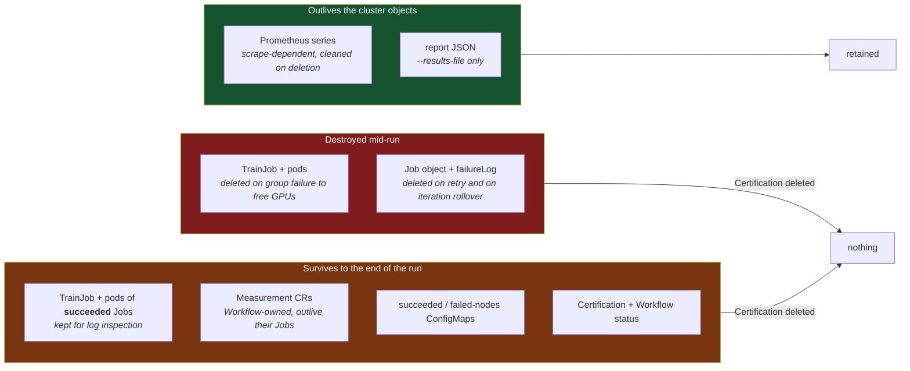
```mermaid
flowchart LR
    subgraph T1["Destroyed mid-run"]
        E1["TrainJob + pods<br/><i>deleted on group failure to free GPUs</i>"]
        E2["Job object + failureLog<br/><i>deleted on retry and on iteration rollover</i>"]
    end
    subgraph T2["Survives to the end of the run"]
        E3["TrainJob + pods of <b>succeeded</b> Jobs<br/><i>kept for log inspection</i>"]
        E4["Measurement CRs<br/><i>Workflow-owned, outlive their Jobs</i>"]
        E5["succeeded / failed-nodes ConfigMaps"]
        E6["Certification + Workflow status"]
    end
    subgraph T3["Outlives the cluster objects"]
        E7["Prometheus series<br/><i>scrape-dependent, cleaned on deletion</i>"]
        E8["report JSON<br/><i>--results-file only</i>"]
    end
    T1 -->|"Certification deleted"| X["nothing"]
    T2 -->|"Certification deleted"| X
    T3 --> K["retained"]

    style T1 fill:#7f1d1d,color:#f9fafb
    style T2 fill:#78350f,color:#f9fafb
    style T3 fill:#14532d,color:#f9fafb
```

Deleting the Certification — which is exactly what `nvcrectl certification run
--cleanup` does immediately after printing the report — cascades through every
run-scoped row above. **If `--results-file` was not passed, the run leaves no
record.**

---

## 8. Edge cases

### 8.1 A node can be both passed and failed

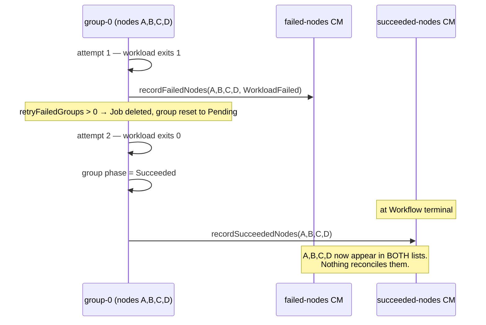
```mermaid
sequenceDiagram
    participant G as group-0 (nodes A,B,C,D)
    participant CMF as failed-nodes CM
    participant CMS as succeeded-nodes CM
    G->>G: attempt 1 — workload exits 1
    G->>CMF: recordFailedNodes(A,B,C,D, WorkloadFailed)
    Note over G: retryFailedGroups > 0 → Job deleted, group reset to Pending
    G->>G: attempt 2 — workload exits 0
    G->>G: group phase = Succeeded
    Note over CMS: at Workflow terminal
    G->>CMS: recordSucceededNodes(A,B,C,D)
    Note over CMF,CMS: A,B,C,D now appear in BOTH lists.<br/>Nothing reconciles them.
```

`completeTerminalGroup` writes failed nodes **before** branching to retry.
Same mechanism applies across `repeatCount` iterations: `succeededNodesForWorkflow`
reads only the **final** iteration's groups, while the failed-nodes ConfigMap
accumulates across **all** iterations and attempts. An archive must therefore key
node verdicts by `(category, iteration, attempt)` and define the reduction rule
explicitly (latest-wins? all-must-pass? any-fail-is-fail?) rather than merging.

### 8.2 Full edge-case register

| # | Edge case | Where it lives | Consequence for a results model |
|---|---|---|---|
| 1 | Node in both succeeded and failed lists | §8.1 | verdicts must be attempt-scoped, with an explicit reduction rule |
| 2 | Retried Job is **deleted** | `completeTerminalGroup` retry branch | the failing attempt's `failureLog` and measurements are destroyed; only the node names survive |
| 3 | Iteration rollover deletes Jobs | `handleIterationComplete` | per-iteration Job evidence is lost; only `iterationHistory` timings remain |
| 4 | Excluded nodes → `INCOMPLETE`, exit 0 | `report.Build` | "PASSED" must never be recorded without the coverage denominator |
| 5 | Certification `Failed` can revert to `InProgress` | `recoverIfWorkflowStillRunning` | a terminal read is not a safe archive trigger by itself |
| 6 | `CertificationValidationFailed` is **declared but never set** | `certification_types.go:27` | the threshold-quality signal dies at the Workflow tier; only WorkloadRun consumes it |
| 7 | `CertReport.NodeResults` populated **only** on the WorkloadRun path | `workloadrun.go:1471` vs `report.Build` | the certification report JSON has no per-node array — only a flat `failedNodes` union |
| 8 | Group-level blame for `WorkloadFailed` / `ThresholdViolation` | `groupNodeNames` | a 64-node NCCL failure marks 64 nodes; confidence must be recorded alongside the verdict |
| 9 | `succeededNodesForWorkflow` uses `Diagnose.HealthyNodes` when diagnose ran | `node_results.go` | two different provenance paths for the same field |
| 10 | Workflow writes `Failed` onto the **Job** on timeout | `updateStatusFromJobs` | condition authorship is not single-writer; provenance should be recorded |
| 11 | Measurement values provisional until `Complete=True` | ADR-072 | archive must capture the freeze flag, not just the number |
| 12 | Report computes `Result` from **live** conditions on every invocation | `report.Build` | the report is a view, not a record; re-running it after cleanup yields nothing |
| 13 | `groups[].nodes` still inline on the CR | ADR-068 (not implemented) | at ~6k nodes the status write is rejected atomically and the run wedges |
| 14 | ConfigMap name = 8 hex chars of Workflow UID | `nodeResultsCMName` | collision-tolerant but not globally unique across clusters/time |
| 15 | Node identity = `kubernetes.io/hostname` | everywhere | no serial / system UUID / GPU UUID; a re-imaged or replaced host reuses the verdict key |
| 16 | Spec is immutable but catalog/image/controller versions are not recorded | `certification_types.go` | a run cannot be reproduced from its own record |
| 17 | Pod-drain barrier holds groups open | issue #121 | completion timestamps include drain time; duration ≠ workload runtime |
| 18 | Kueue-suspended workloads are `Pending`, clock not started | `updateStatusFromWorkload` | wall-clock span ≠ `workloadStartTime → completionTime` |
| 19 | `measurementTimeout` fails validation when no data arrives | `checkPerformanceThresholds` | "failed" here means *unmeasured*, not *slow* — a distinct verdict class |
| 20 | Unknown threshold key fails immediately | `threshold.ValidateKeysError` | config error surfaces as a node-level `ThresholdViolation` |

### 8.3 Where failures come from, and which ones are attributable

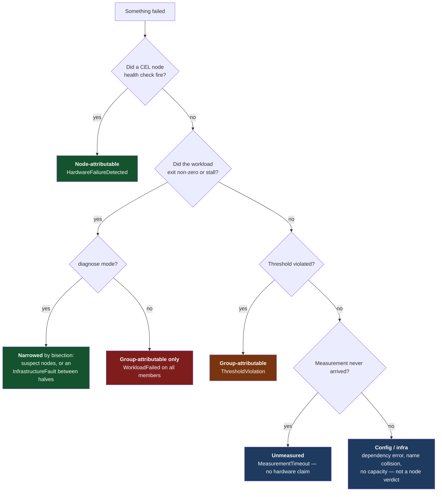
```mermaid
flowchart TD
    F["Something failed"] --> Q1{"Did a CEL node<br/>health check fire?"}
    Q1 -->|yes| A1["<b>Node-attributable</b><br/>HardwareFailureDetected"]
    Q1 -->|no| Q2{"Did the workload<br/>exit non-zero or stall?"}
    Q2 -->|yes| Q3{"diagnose mode?"}
    Q3 -->|yes| A2["<b>Narrowed</b> by bisection:<br/>suspect nodes, or an<br/>InfrastructureFault between halves"]
    Q3 -->|no| A3["<b>Group-attributable only</b><br/>WorkloadFailed on all members"]
    Q2 -->|no| Q4{"Threshold violated?"}
    Q4 -->|yes| A4["<b>Group-attributable</b><br/>ThresholdViolation"]
    Q4 -->|no| Q5{"Measurement never arrived?"}
    Q5 -->|yes| A5["<b>Unmeasured</b><br/>MeasurementTimeout — no hardware claim"]
    Q5 -->|no| A6["<b>Config / infra</b><br/>dependency error, name collision,<br/>no capacity — not a node verdict"]

    style A1 fill:#14532d,color:#f9fafb
    style A2 fill:#14532d,color:#f9fafb
    style A3 fill:#7f1d1d,color:#f9fafb
    style A4 fill:#78350f,color:#f9fafb
    style A5 fill:#1e3a5f,color:#f9fafb
    style A6 fill:#1e3a5f,color:#f9fafb
```

Only the green paths justify a hardware claim about a specific node. The current
data model flattens all of them into the same `FailedNode{name, reason, message}`.

---

## 9. A data model for archiving outcomes

### 9.1 What the archive must answer

1. *Was node X certified, by which test, when, and against which thresholds?*
2. *What was measured on it, and was that number final?*
3. *If it failed, is that a claim about the node, its group, or its fabric?*
4. *Could this run be reproduced — same catalog, same images, same controller?*
5. *How does today's fleet compare with last month's?*

Today's ConfigMaps answer (1) partially and (3) not at all; the report JSON is a
rendered view rather than a record.

### 9.2 Proposed entities

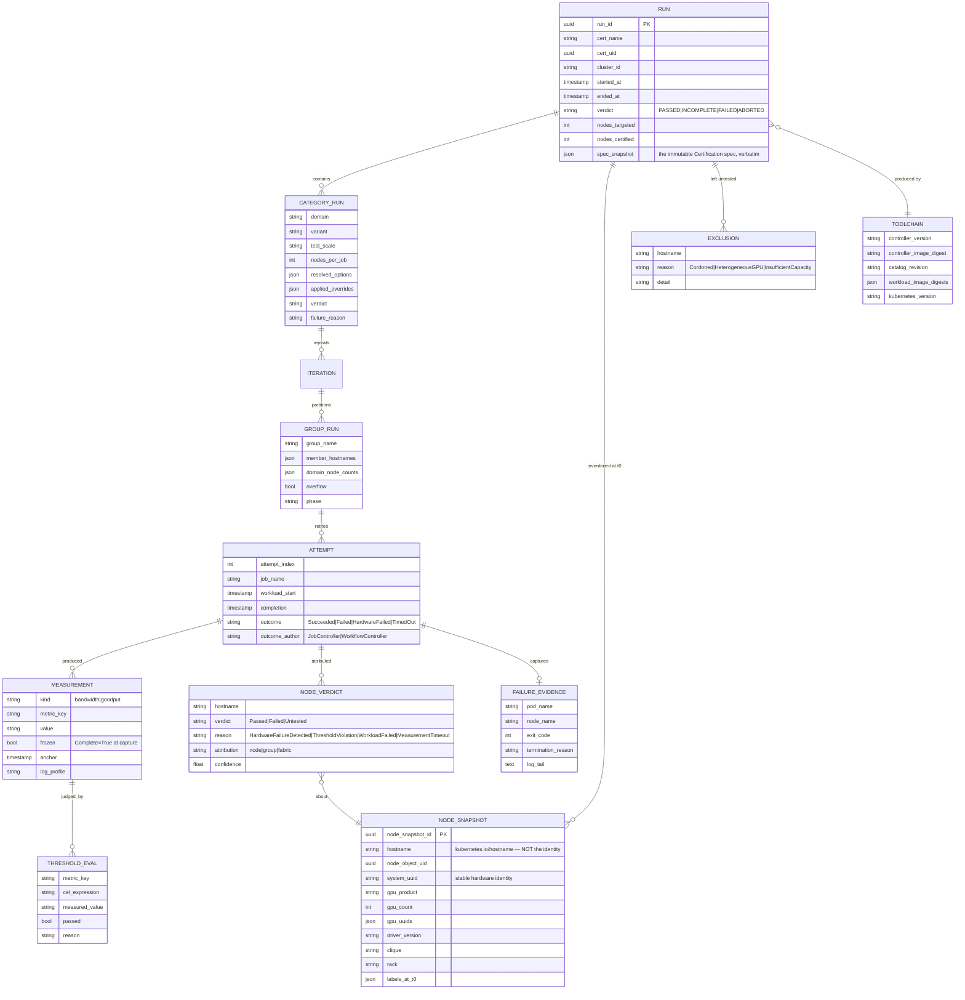
```mermaid
erDiagram
    RUN ||--o{ CATEGORY_RUN : contains
    RUN ||--o{ NODE_SNAPSHOT : "inventoried at t0"
    RUN ||--o{ EXCLUSION : "left untested"
    RUN }o--|| TOOLCHAIN : "produced by"
    CATEGORY_RUN ||--o{ ITERATION : repeats
    ITERATION ||--o{ GROUP_RUN : partitions
    GROUP_RUN ||--o{ ATTEMPT : "retries"
    ATTEMPT ||--o{ MEASUREMENT : produced
    ATTEMPT ||--o{ NODE_VERDICT : attributed
    ATTEMPT ||--o| FAILURE_EVIDENCE : captured
    NODE_VERDICT }o--|| NODE_SNAPSHOT : "about"
    MEASUREMENT ||--o{ THRESHOLD_EVAL : judged_by

    RUN {
        uuid run_id PK
        string cert_name
        uuid cert_uid
        string cluster_id
        timestamp started_at
        timestamp ended_at
        string verdict "PASSED|INCOMPLETE|FAILED|ABORTED"
        int nodes_targeted
        int nodes_certified
        json spec_snapshot "the immutable Certification spec, verbatim"
    }
    TOOLCHAIN {
        string controller_version
        string controller_image_digest
        string catalog_revision
        json workload_image_digests
        string kubernetes_version
    }
    NODE_SNAPSHOT {
        uuid node_snapshot_id PK
        string hostname "kubernetes.io/hostname — NOT the identity"
        uuid node_object_uid
        string system_uuid "stable hardware identity"
        string gpu_product
        int gpu_count
        json gpu_uuids
        string driver_version
        string clique
        string rack
        json labels_at_t0
    }
    EXCLUSION {
        string hostname
        string reason "Cordoned|HeterogeneousGPU|InsufficientCapacity"
        string detail
    }
    CATEGORY_RUN {
        string domain
        string variant
        string test_scale
        int nodes_per_job
        json resolved_options
        json applied_overrides
        string verdict
        string failure_reason
    }
    GROUP_RUN {
        string group_name
        json member_hostnames
        json domain_node_counts
        bool overflow
        string phase
    }
    ATTEMPT {
        int attempt_index
        string job_name
        timestamp workload_start
        timestamp completion
        string outcome "Succeeded|Failed|HardwareFailed|TimedOut"
        string outcome_author "JobController|WorkflowController"
    }
    MEASUREMENT {
        string kind "bandwidth|goodput"
        string metric_key
        string value
        bool frozen "Complete=True at capture"
        timestamp anchor
        string log_profile
    }
    THRESHOLD_EVAL {
        string metric_key
        string cel_expression
        string measured_value
        bool passed
        string reason
    }
    NODE_VERDICT {
        string hostname
        string verdict "Passed|Failed|Untested"
        string reason "HardwareFailureDetected|ThresholdViolation|WorkloadFailed|MeasurementTimeout"
        string attribution "node|group|fabric"
        float confidence
    }
    FAILURE_EVIDENCE {
        string pod_name
        string node_name
        int exit_code
        string termination_reason
        text log_tail
    }
```

### 9.3 Design rules the code argues for

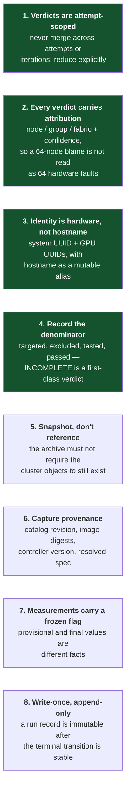
```mermaid
flowchart LR
    R1["<b>1. Verdicts are attempt-scoped</b><br/>never merge across attempts or<br/>iterations; reduce explicitly"]
    R2["<b>2. Every verdict carries attribution</b><br/>node / group / fabric + confidence,<br/>so a 64-node blame is not read<br/>as 64 hardware faults"]
    R3["<b>3. Identity is hardware, not hostname</b><br/>system UUID + GPU UUIDs, with<br/>hostname as a mutable alias"]
    R4["<b>4. Record the denominator</b><br/>targeted, excluded, tested, passed —<br/>INCOMPLETE is a first-class verdict"]
    R5["<b>5. Snapshot, don't reference</b><br/>the archive must not require the<br/>cluster objects to still exist"]
    R6["<b>6. Capture provenance</b><br/>catalog revision, image digests,<br/>controller version, resolved spec"]
    R7["<b>7. Measurements carry a frozen flag</b><br/>provisional and final values are<br/>different facts"]
    R8["<b>8. Write-once, append-only</b><br/>a run record is immutable after<br/>the terminal transition is stable"]

    style R1 fill:#14532d,color:#f9fafb
    style R2 fill:#14532d,color:#f9fafb
    style R3 fill:#14532d,color:#f9fafb
    style R4 fill:#14532d,color:#f9fafb
```

### 9.4 Where the archive should be written from

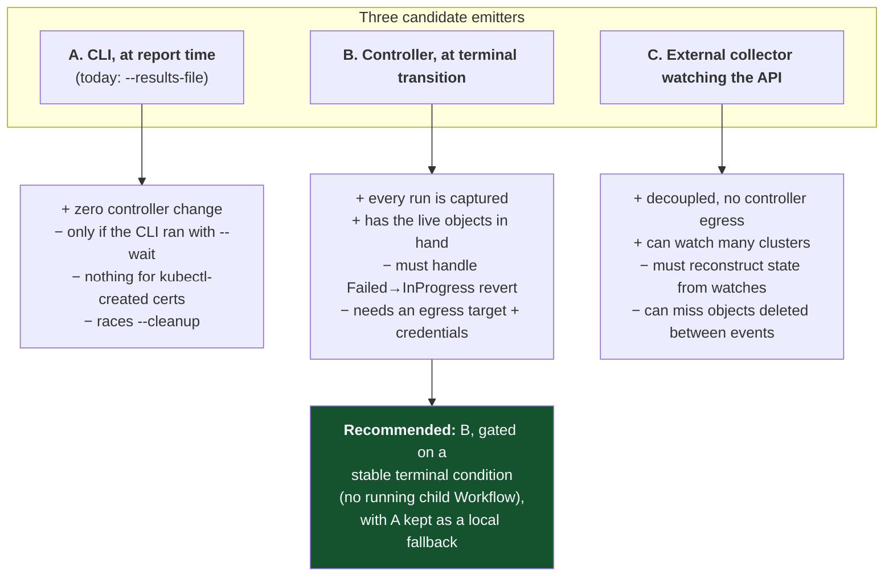
```mermaid
flowchart TD
    subgraph OPT["Three candidate emitters"]
        A["<b>A. CLI, at report time</b><br/>(today: --results-file)"]
        B["<b>B. Controller, at terminal transition</b>"]
        C["<b>C. External collector watching the API</b>"]
    end
    A --> AP["+ zero controller change<br/>− only if the CLI ran with --wait<br/>− nothing for kubectl-created certs<br/>− races --cleanup"]
    B --> BP["+ every run is captured<br/>+ has the live objects in hand<br/>− must handle Failed→InProgress revert<br/>− needs an egress target + credentials"]
    C --> CP["+ decoupled, no controller egress<br/>+ can watch many clusters<br/>− must reconstruct state from watches<br/>− can miss objects deleted between events"]

    BP --> REC["<b>Recommended:</b> B, gated on a<br/>stable terminal condition<br/>(no running child Workflow),<br/>with A kept as a local fallback"]

    style REC fill:#14532d,color:#f9fafb
```

The determining constraint is edge case #5: the Certification's terminal
condition can revert. The emit trigger must be *terminal **and** no child Workflow
in a non-terminal state*.

No existing function performs that check. `recoverIfWorkflowStillRunning`
(`certification_controller.go:832`) looks like it does, but it filters to
categories whose status is `Failed` and skips the rest, so on a `Succeeded`
Certification it inspects nothing and returns `false`. It is a recovery hook for
one staleness case, not a stability predicate. An emitter needs its own sweep over
every category, plus a settle delay: `completeTerminalGroup` marks a group `Failed`
as soon as the workload fails, without waiting for the ADR-072 measurement freeze,
so at the instant a Certification goes terminal a failed group's measurement can
still be `Measuring=True`. The delay narrows that window; the per-measurement
frozen flag (rule R7) is what makes the record correct regardless.

### 9.5 Gap summary — today vs. the model

| Requirement | Today | Gap |
|---|---|---|
| Per-node verdict with reason | failed-nodes ConfigMap ✓ | not attempt-scoped; contradicts succeeded list |
| Per-node verdict for passes | succeeded-nodes ConfigMap ✓ | final iteration only; no reason/evidence |
| Attribution granularity | reason enum only | no node/group/fabric distinction |
| Hardware identity | hostname | no system UUID / GPU UUID |
| Coverage denominator | `excludedNodes` + `INCOMPLETE` ✓ | not in a durable per-node form |
| Measurement values | measurement CRs, frozen ✓ | deleted with the Workflow; not per-node |
| Failure evidence | `Job.status.failureLog` ✓ | deleted on retry and iteration rollover |
| Provenance | `appliedOverrides`, detected platform/arch ✓ | no catalog revision, image digests, controller version |
| Durable store | report JSON via `--results-file` | opt-in, CLI-only, races `--cleanup` |
| Cross-run comparison | none | no stable run or node key |

---

## 10. Reading guide

| Question | File |
|---|---|
| Category sequencing, node discovery, option resolution | `pkg/controller/certification_controller.go` |
| Partitioning, groups, iterations, timeouts, diagnose | `pkg/controller/workflow_controller.go` |
| Workload lifecycle, thresholds, CEL health, checkpoints | `pkg/controller/job_controller.go` |
| Node-result ConfigMaps | `pkg/controller/node_results.go` |
| Report construction and verdict | `pkg/report/report.go` |
| Measurement freeze | ADR-072, `pkg/controller/goodputmeasurement_controller.go` |
| Failed-node attribution contract | ADR-061 |
| Succeeded-node ConfigMap | ADR-062 |
| Inline node-list scaling (not yet implemented) | ADR-068 |
| Adaptive fault isolation | ADR-055 |
